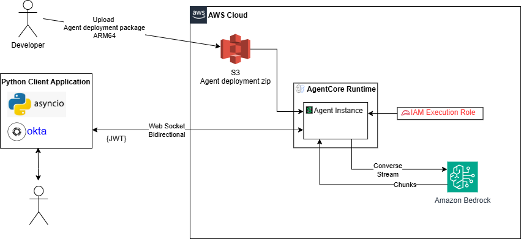

# agentcore-bidirectional-streaming-with-strands

A conversational AI agent runtime built on AWS Bedrock AgentCore and Strands Agents framework. This project demonstrates bidirectional WebSocket streaming for real-time conversations with Claude models.

## Architecture



## Overview

AgentCore is a serverless AI assistant runtime designed to run on AWS Bedrock AgentCore. It enables:

- **Real-time streaming responses** via WebSocket connections
- **Bidirectional communication** - clients can send multiple questions in a single session
- **AWS Bedrock integration** using Claude models (default: Claude 3.5 Sonnet)
- **MCP tool integration** via the [PharmacyMCP](https://github.com/your-org/PharmacyMCP) server, providing access to the Health Canada Drug Product Database (DPD)
- **Production-ready logging** with configurable log levels
- **Standardized error handling** for authentication, validation, and server errors

The agent connects to a separately-running MCP server over **Streamable HTTP** transport rather than spawning it as a subprocess, keeping the two services independently deployable.

### Key Components

| Component | Description |
|-----------|-------------|
| `src/agent.py` | Main agent application with WebSocket handler |
| `src/client.py` | Sample client for testing the deployed agent |
| `utils/logger.py` | Configurable logging with CloudWatch support |
| `utils/error_handler.py` | Standardized error response utilities |
| `build.ps1` | Automated packaging script for agent deployment |

> **MCP Server:** This agent requires the [PharmacyMCP](https://github.com/your-org/PharmacyMCP) server to be running separately and accessible at `MCP_SERVER_URL` (default: `http://localhost:8000/mcp`).

## Prerequisites

Before getting started, ensure you have the following installed:

- **Python 3.11+** - [Download Python](https://www.python.org/downloads/)
- **pip** - Python package manager (included with Python)
- **AWS CLI** - [Install AWS CLI](https://docs.aws.amazon.com/cli/latest/userguide/getting-started-install.html)
- **AWS Account** with Bedrock access enabled
- **PowerShell 5.1+** (Windows) or **Bash** (Linux/macOS)
- **PharmacyMCP server** - cloned and runnable at `http://localhost:8000/mcp` (see its own README for setup)

### AWS Configuration

The agent requires valid AWS credentials to access Bedrock services. Choose one of the following methods:

#### Option 1: AWS CLI Configuration (Recommended for Development)

```bash
aws configure
```

You'll be prompted for:
- AWS Access Key ID
- AWS Secret Access Key
- Default region (e.g., `us-east-1`)
- Default output format (e.g., `json`)

#### Option 2: Environment Variables

Set credentials directly as environment variables:

**Windows (PowerShell):**
```powershell
$env:AWS_ACCESS_KEY_ID = "your-access-key-id"
$env:AWS_SECRET_ACCESS_KEY = "your-secret-access-key"
$env:AWS_REGION = "us-east-1"
```

**Linux/macOS:**
```bash
export AWS_ACCESS_KEY_ID="your-access-key-id"
export AWS_SECRET_ACCESS_KEY="your-secret-access-key"
export AWS_REGION="us-east-1"
```

#### Option 3: Temporary Credentials (SSO/Assumed Roles)

If using AWS SSO or assumed roles, you'll also need a session token:

**Windows (PowerShell):**
```powershell
$env:AWS_ACCESS_KEY_ID = "your-access-key-id"
$env:AWS_SECRET_ACCESS_KEY = "your-secret-access-key"
$env:AWS_SESSION_TOKEN = "your-session-token"
$env:AWS_REGION = "us-east-1"
```

**Linux/macOS:**
```bash
export AWS_ACCESS_KEY_ID="your-access-key-id"
export AWS_SECRET_ACCESS_KEY="your-secret-access-key"
export AWS_SESSION_TOKEN="your-session-token"
export AWS_REGION="us-east-1"
```

**For AWS SSO users:**
```bash
aws configure sso
aws sso login --profile your-profile-name
```

#### Verify Credentials

To verify your AWS credentials are working:

```bash
aws sts get-caller-identity
```

This should return your AWS account ID and user/role information.

## Getting Started

### Step 1: Clone the Repository

```bash
git clone <repository-url>
cd agentcore-bidirectional-streaming-with-strands
```

### Step 2: Create a Virtual Environment

**Windows (PowerShell):**
```powershell
python -m venv venv
.\venv\Scripts\Activate.ps1
```

**Linux/macOS:**
```bash
python3 -m venv venv
source venv/bin/activate
```

### Step 3: Install Dependencies

```bash
pip install -r requirements.txt
```

### Step 4: Set Environment Variables

Create a `src/.env` file with the following variables (a template is provided):

```dotenv
# AWS / Bedrock
AWS_REGION=us-east-1
BEDROCK_MODEL_ID=anthropic.claude-3-5-sonnet-20240620-v1:0
LOG_LEVEL=DEBUG

# MCP Server (Streamable HTTP transport)
MCP_SERVER_URL=http://localhost:8000/mcp

# Agent WebSocket endpoint (for client.py)
AGENT_ENDPOINT=ws://localhost:8080/ws
```

Adjust `MCP_SERVER_URL` if the PharmacyMCP server runs on a different host or port.

### Step 5: Start the MCP Server

In a **separate terminal**, start the PharmacyMCP server:

```bash
cd /path/to/PharmacyMCP
.venv\Scripts\activate   # Windows
python -m src.dpd_server  # adjust if entry point differs
```

The server should be listening at `http://localhost:8000/mcp`.

### Step 6: Run the Agent Locally

```bash
cd src
python agent.py
```

The agent will connect to the MCP server, load its tools, and start listening on port `8080`.

## Testing the Agent

### Using the Sample Client

1. Update `src/client.py` with your OAuth configuration (if using authentication)
2. Set the endpoint to your local server:
   ```python
   AGENT_ENDPOINT = "ws://localhost:8080/ws"
   ```
3. Run the client:
   ```bash
   python src/client.py
   ```

### Using WebSocket Tools

You can also test with tools like [wscat](https://github.com/websockets/wscat):

```bash
npm install -g wscat
wscat -c ws://localhost:8080/ws
```

Send a message:
```json
{"prompt": "Hello, how are you?"}
```

## Deployment

### Building the Deployment Package

Run the build script to create a deployment-ready ZIP:

**Windows (PowerShell):**
```powershell
.\build.ps1
```

**Options:**
```powershell
.\build.ps1 -Clean                           # Force clean rebuild
.\build.ps1 -OutputZip "custom-name.zip"     # Custom output filename
.\build.ps1 -Platform "manylinux2014_x86_64" # Different platform target
```

This creates `agentcore-runtime.zip` with all dependencies for AWS Lambda ARM64.

### Docker Deployment

Build and run using Docker:

```bash
cd src
docker build -t agentcore:latest .
docker run -p 8080:8080 \
  -e AWS_REGION=us-east-1 \
  -e BEDROCK_MODEL_ID=anthropic.claude-3-5-sonnet-20240620-v1:0 \
  -e AWS_ACCESS_KEY_ID=<your-key> \
  -e AWS_SECRET_ACCESS_KEY=<your-secret> \
  agentcore:latest
```

### AWS Bedrock AgentCore Deployment

Deploy to AWS Bedrock AgentCore:

```bash
agentcore launch --zip agentcore-runtime.zip
```

## Project Structure

```
agentcore-bidirectional-streaming-with-strands/
├── src/
│   ├── agent.py          # Main agent application
│   ├── client.py         # Sample WebSocket client
│   ├── Dockerfile        # Container configuration
│   └── __init__.py
├── utils/
│   ├── logger.py         # Logging utilities
│   ├── error_handler.py  # Error handling utilities
│   └── __init__.py
├── package/              # Build output (generated)
├── requirements.txt      # Python dependencies
├── build.ps1             # Build automation script
└── README.md
```

## Configuration

### Environment Variables

| Variable | Description | Default |
|----------|-------------|---------|
| `AWS_REGION` | AWS region for Bedrock | `us-east-1` |
| `BEDROCK_MODEL_ID` | Bedrock model identifier | `anthropic.claude-3-5-sonnet-20240620-v1:0` |
| `LOG_LEVEL` | Logging verbosity | `INFO` |
| `MCP_SERVER_URL` | URL of the running PharmacyMCP server | `http://localhost:8000/mcp` |
| `AGENT_ENDPOINT` | WebSocket endpoint (used by `client.py`) | `ws://localhost:8080/ws` |

### Supported Models

- `anthropic.claude-3-5-sonnet-20240620-v1:0` (default)
- `anthropic.claude-3-haiku-20240307-v1:0`
- `anthropic.claude-3-opus-20240229-v1:0`

## WebSocket API

### Request Format

```json
{
  "prompt": "Your question here"
}
```

### Response Format

**Streaming chunk:**
```json
{
  "type": "chunk",
  "content": "Partial response text..."
}
```

**End of turn:**
```json
{
  "type": "end_of_turn"
}
```

**Error:**
```json
{
  "type": "error",
  "error": "Error Type",
  "message": "Error description"
}
```

## Troubleshooting

### Common Issues

**"Failed to create BedrockModel"**
- Verify AWS credentials are configured correctly
- Ensure your AWS account has Bedrock access enabled
- Check that the model ID is valid for your region

**"Connection refused on port 8080"**
- Ensure the agent is running (`python agent.py`)
- Check if another process is using port 8080

**"Failed to connect to MCP server"**
- Ensure the PharmacyMCP server is running before starting the agent
- Verify `MCP_SERVER_URL` in `src/.env` matches the server's actual host/port
- Confirm the server exposes the `/mcp` endpoint (Streamable HTTP transport)

**"No prompt provided" error**
- Ensure WebSocket messages include a `prompt` field

### Enabling Debug Logging

```powershell
$env:LOG_LEVEL = "DEBUG"
python src/agent.py
```

## License

[Add your license here]

## Contributing

[Add contribution guidelines here]
